A gamepad/trackpad for linux phones/tablets implemented using wayland’s layer shell protocol. As no-one has yet to. While running it consumes ~2-5% cpu. While disabled it consumes 0% cpu, so you can always leave it running.


Controls:
- **Activate edit:** mode by taping top left screen.
- **Enable/disable:** hold volume down for 250ms
- **Switch orientation:** volume up for 250ms
- **Control volume:** press volume up/down FASTER than 250ms

Only **PHOSH** and **PLASMA MOBILE** are tested and supported. i.e, see:
https://wayland.app/protocols/wlr-layer-shell-unstable-v1#compositor-support

ironic… considering most layer shell projects use GTK :/

### **WARNING** **WARNING** **WARNING**!!!
Due to "wayland?" limitations, the ***UI WILL NOT BE RENDERED ON THE LOCK SCREEN.***   so if you lock while in edit mode, you may be confused why no touches are registered, and nothing is visible.

Manually disable using volume down, unlock screen, the re-enable with volume down. There is no solution yet.

## Building

Debian/Mobian:
```
apt install build-essential libwayland-dev libwayland-protocols-dev libegl-dev libgles-dev libgl-dev
```

Alpine
```
apk add build-base pkgconf wayland-dev wayland-protocols mesa-dev
```
Build:
```
make
```

## Running
Root

(the -E is important, otherwise it will not connect to wayland)

```
sudo -E ./wlr-gamepad
```

"Rootless"
```
sudo chmod 666 /dev/input/* && sudo chmod 777 /dev/uinput
```
```
./wlr-gamepad
```

## Settings
Currently hardcoded:
```c
static const float kTrackpadSensitivity = 1.0f;
```
```c
static float gMasterOpacity = 0.5f;
```

## Architecture
- OpenGL immediate mode rendering
- Minimal dependencies
- Simplicity, nothing unnecessary
- Old school C UI look

```mermaid
graph TD
    A0["main()"] --> A1{"Initialize Systems"}
    A1 --> A2["Wayland/EGL Setup"]
    A1 --> A3["OpenGL Setup"]
    A1 --> A4["uinput_init()"]
    A1 --> A5["init_touch_device()"]
    A1 --> A6["find_input_device() for Volume Keys"]
    A1 --> A7["Widget System Init (UpdateAllWidgetCoords)"]
    A1 --> A8["Main Loop (while running)"]

    A8 --> A9{"Event Polling (poll: Wayland, Touch, Volume Keys)"}
    A9 -- "Wayland Event" --> A10["wl_display_read_events()"]
    A10 --> A11["Wayland Callbacks (e.g., layer_surface_handle_configure)"]
    A11 --> A12["Update width, height, gViewportChanged, RecalculateGridLayout"]
    A12 --> A7

    A9 -- "Volume Key Event (Down/Up)" --> A13["Handle Volume Key Press"]
    A13 -- "Long Press VolDown" --> A14["toggle_overlay()"]
    A13 -- "Long Press VolUp" --> A14b["Toggle gLandscapeMode"]
    A13 -- "Short Press VolDown/Up" --> A4b["uinput_key() for Volume"]
    A14 --> A15["Update gOverlayActive"]
    A15 -- "Overlay Inactive" --> A8
    A15 -- "Overlay Active" --> A16

    A9 -- "Touch Event" --> A16["read gTouchDevFd"]
    A16 --> A17["handle_evdev_event()"]

    A17 --> A18["Update MTSlot state (x, y, active)"]
    A17 -- "EV_SYN_REPORT" --> A19{"Process Touch Slots"}

    A19 --> A20["UpdateAllWidgetCoords(width, height)"]
    A19 --> A21["ProcessAllWidgetsInput() (if APP_STATE_RUNNING)"]
    A21 --> WProcTbl["widget_proc_tbl (calls joystick/dpad/button_process)"]
    WProcTbl --> WOut["Update Widget.outputValue / Widget.data.button.isPressed"]

    A19 --> A22["InputState_Update()"]
    A22 -- "Based on Widget.outputValue" --> A23["enqueue_event()"]
    A23 --> A24["gInputEvents Queue"]

    A19 --> A25["InputState_Flush()"]
    A25 -- "Reads gInputEvents" --> A4c["uinput_key() for widget actions"]

    A19 --> A26["RenderFrame(width, height)"]
    A26 --> A8

    %% --- Application State Machine & Touch Interaction Logic (within handle_evdev_event) ---
    subgraph AppStateLogic ["Application State & Touch Interaction"]
        AS_Main["gAppState"]
        AS_Run["APP_STATE_RUNNING"]
        AS_Edit["APP_STATE_EDIT_MODE"]
        AS_MenuAdd["APP_STATE_MENU_ADD_WIDGET"]
        AS_MenuProps["APP_STATE_MENU_WIDGET_PROPERTIES"]
        AS_MenuRemapAction["APP_STATE_MENU_REMAP_ACTION"]
        AS_MenuRemapKey["APP_STATE_MENU_REMAP_KEY"]

        A17 --> AS_Main
        AS_Main --"Guides"--> TouchDispatch{"Touch Down/Move/Up Logic in handle_evdev_event"}

        TouchDispatch --"Touch Down"--> TD_CheckUI["HandleUITouchDown() for Edit/Add/Props Buttons"]
        TD_CheckUI --"Button Hit"--> ChangeState1["Change gAppState (e.g., RUNNING <-> EDIT_MODE, EDIT_MODE -> MENU_ADD_WIDGET)"]
        ChangeState1 --> AS_Main

        TouchDispatch --"Touch Down, AppState: RUNNING"--> TD_Run
        TD_Run --"Widget Hit"--> Run_WidgetControl["Assign Widget.controllingFinger, slot_mode=SLOT_WIDGET"]
        TD_Run --"No Widget Hit"--> Run_Trackpad["slot_mode=SLOT_TRACKPAD, init track_last_x/y"]

        TouchDispatch --"Touch Down, AppState: EDIT_MODE"--> TD_Edit
        TD_Edit --"Widget Hit"--> Edit_SelectOrAction["Select Widget (gSelectedWidgetId) / Init gEditState (MOVE/RESIZE)"]
        TD_Edit --"Background Hit"--> Edit_Deselect["gSelectedWidgetId = 0"]

        TouchDispatch --"Touch Down, AppState: MENUS"--> TD_Menus
        TD_Menus --"MENU_ADD_WIDGET"--> MenuAdd_Action["CreateWidget(), Change gAppState to EDIT_MODE"]
        TD_Menus --"MENU_WIDGET_PROPERTIES"--> MenuProps_Action
        MenuProps_Action --"Delete"--> MenuProps_Delete["RemoveWidgetByIndex(), Change gAppState to EDIT_MODE"]
        MenuProps_Action --"Remap"--> MenuProps_Remap["Set gRemappingWidgetId, Change gAppState to REMAP_ACTION or REMAP_KEY"]
        TD_Menus --"MENU_REMAP_ACTION"--> MenuRemapAction_Action["Set gRemapAction, Change gAppState to REMAP_KEY"]
        TD_Menus --"MENU_REMAP_KEY"--> MenuRemapKey_Action["Update Widget KeyMapping, Change gAppState to EDIT_MODE"]
        MenuAdd_Action --> AS_Main
        MenuProps_Delete --> AS_Main
        MenuProps_Remap --> AS_Main
        MenuRemapAction_Action --> AS_Main
        MenuRemapKey_Action --> AS_Main

        TouchDispatch --"Touch Move, slot_mode: SLOT_WIDGET, AppState: EDIT_MODE"--> Move_EditAction["HandleWidgetEditAction() -> Update Widget normCenter/normHalfSize"]
        TouchDispatch --"Touch Move, slot_mode: SLOT_TRACKPAD, AppState: RUNNING"--> Move_Trackpad["uinput_move()"]

        TouchDispatch --"Touch Up, slot_mode: SLOT_WIDGET"--> Up_Widget
        Up_Widget --"AppState: RUNNING"--> Run_ReleaseWidget["Widget.controllingFinger = INVALID_FINGER_ID"]
        Up_Widget --"AppState: EDIT_MODE"--> Edit_FinalizeAction["Reset gEditState"]
        TouchDispatch --"Touch Up, slot_mode: SLOT_TRACKPAD"--> Up_Trackpad
        Up_Trackpad --"No Move"--> Trackpad_Click["uinput_key(BTN_LEFT, press/release)"]
        Up_Trackpad --> ResetSlotMode["slot_mode = SLOT_IDLE"]
        Up_Widget --> ResetSlotMode
    end

    %% --- Widget System ---
    subgraph WidgetSystem ["Widget System"]
        WS_Data["Widget Struct (id, type, pos, size, state, union data)"]
        WS_Array["gWidgets[MAX_WIDGETS], gNumWidgets"]
        WS_Mgr["Widget Management Functions (CreateWidget, RemoveWidgetByIndex, FindWidgetIndexById, Widget_UpdateAbsCoords)"]
        WS_DispatchDraw["widget_draw_tbl (Joystick/DPad/Button_draw)"]
        WS_DispatchProcess["widget_proc_tbl (Joystick/DPad/Button_process)"]

        WS_Mgr --> WS_Array
        AS_Main --"Triggers Widget Create/Delete"--> WS_Mgr
        A21 -.-> WS_DispatchProcess
    end
    WOut --> WS_Data

    %% --- Rendering System (within RenderFrame) ---
    subgraph RenderingSystem ["Rendering System (OpenGL)"]
        R0["RenderFrame()"]
        R1["glClear()"]
        R2["DrawAllWidgets(editMode)"]
        R2 --> WS_DispatchDraw
        WS_DispatchDraw --> R_Primitives["Drawing Primitives (DrawRect, DrawCircle, etc.)"]
        WS_DispatchDraw --> R_Text["RenderText()"]
        R_Primitives --> R_GL["OpenGL Commands (glVertex, glColor, etc.)"]
        R_Text --> R_GL

        R0 --"Based on gAppState"--> R3{"Draw Menus?"}
        R3 --"Yes"--> R4["DrawWidgetSelectionMenu() / DrawWidgetPropertiesMenu() / etc."]
        R4 --> R_GenericMenu["DrawGenericMenu()"]
        R_GenericMenu --> R_GenericButton["DrawGenericButton()"]
        R_GenericButton --> R_Primitives
        R_GenericButton --> R_Text

        R0 --> R5["DrawUserInterface(editMode)"]
        R5 --> R6["DrawMainButton(), DrawAddButton(), DrawPropertiesButton()"]
        R6 --> R_GenericButton

        R0 --> R7["eglSwapBuffers()"]
    end
    A26 --> R0


    %% --- UInput System ---
    subgraph UInputSystem ["UInput Virtual Device"]
        UI_Init["uinput_init()"]
        UI_Key["uinput_key(keycode, pressed)"]
        UI_Move["uinput_move(dx, dy)"]
        UI_Destroy["uinput_destroy()"]
        UI_Device["/dev/uinput Kernel Interface"]
    end
    A4 --> UI_Init
    A4b --> UI_Key
    A4c --> UI_Key
    Move_Trackpad --> UI_Move
    Trackpad_Click --> UI_Key
    A8 --"On Exit"--> UI_Destroy
    UI_Init --> UI_Device
    UI_Key --> UI_Device
    UI_Move --> UI_Device
    UI_Destroy --> UI_Device


    %% Styling
    classDef main fill:#f9f,stroke:#333,stroke-width:2px;
    classDef state fill:#ccf,stroke:#333,stroke-width:2px;
    classDef io fill:#9cf,stroke:#333,stroke-width:2px;
    classDef widget fill:#cf9,stroke:#333,stroke-width:2px;
    classDef render fill:#fca,stroke:#333,stroke-width:2px;
    classDef system fill:#eee,stroke:#333,stroke-width:2px;

    class A0,A8 main;
    class AS_Main,AS_Run,AS_Edit,AS_MenuAdd,AS_MenuProps,AS_MenuRemapAction,AS_MenuRemapKey,A15 state;
    class A4,A5,A6,A9,A10,A13,A14,A14b,A16,A17,A18,A19,A23,A24,A25,A4b,A4c io;
    class A2,A3,A26,R0,R1,R2,R3,R4,R5,R6,R7,R_Primitives,R_Text,R_GenericMenu,R_GenericButton render;
    class WS_Data,WS_Array,WS_Mgr,WS_DispatchDraw,WS_DispatchProcess,WProcTbl,WOut,A20,A21,A22 widget;
    class A1,A7,A11,A12,TouchDispatch,TD_CheckUI,ChangeState1,TD_Run,Run_WidgetControl,Run_Trackpad,TD_Edit,Edit_SelectOrAction,Edit_Deselect,TD_Menus,MenuAdd_Action,MenuProps_Action,MenuProps_Delete,MenuProps_Remap,MenuRemapAction_Action,MenuRemapKey_Action,Move_EditAction,Move_Trackpad,Up_Widget,Run_ReleaseWidget,Edit_FinalizeAction,Up_Trackpad,Trackpad_Click,ResetSlotMode system;
    class UI_Init,UI_Key,UI_Move,UI_Destroy,UI_Device io;
```

You could feed this mermaid graph to an LLM for easier re-implementation in other coding languages    

## Limitations

Due to the fact that layer shell is not well supported yet, many basic elements are implemented from scratch, code is quite difficult to follow, and I won’t even try to pretend to understand what “handle_evdev_event” does. if you know some minimal dependency abstractions which could help the complexity, I would love to know.

Things considered:
- Raylib: Good library, a replacement for drawbacks of immediate mode OpenGL while using immediate mode api, but because of simple shapes, there was actually an increase in cpu utilization by default even with little elements.
- Imgui: Impossible, does not support multi touch natively
- Nukklear: overly complicated for what I was trying to accomplish, would need to implement ui gamepad elements except buttons myself anyway, so better to implement the entire ui elements myself.
- gtk-layer-shell: Good project, but not a good fit for such simple ui elements
- SDL3: Can't draw to layer shell egl. Wayland support is not included in the base ubuntu build from what I understand and would require additional building steps.
- GLFW: Can't draw to layer shell egl at all

I’ve even considered rust, but adding just a single egui dependency resulted in a 1.6gb project….

## Todo:
- Test larger screen sizes like tablets, but I’ve tried, and it should work.
- Implement full mouse buttons and scrolling support just like TouchpadEmulator, but with improvements
- Fix font, but I find it charming. xD
- Saving/loading
- Preference menu for opacity, (currently hardcoded) etc.
- Squash bugs
